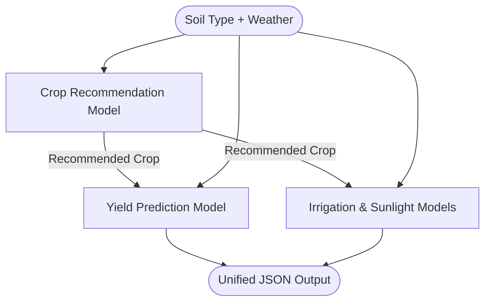

# TerraMind Pre-Sowing Advisor

> [!NOTE]
> The Pre-Sowing Advisor is the centralized machine learning core of the TerraMind system designed to provide comprehensive, data-driven recommendations before cultivation begins.

The Pre-Sowing Advisor consists of a cascade of three targeted machine learning sub-models predicting crop suitability, expected yield, optimal sunlight, and irrigation requirements based on localized soil and climate data.

## 🏗️ Model Architecture

The advisor acts as a sequential pipeline, where answers from foundational models (like Crop Recommendation) feed forward as contextual features into subsequent predictive models (like Yield and Irrigation).

### 1. Crop Recommendation 🌾
- **Model Type**: Random Forest Classifier
- **Objective**: Multi-class classification identifying the most suitable crop from a set of 22 standard varieties.
- **Inputs**: Soil Nutrients (Nitrogen, Phosphorous, Potassium), Soil pH, and Weather (Temperature, Humidity, Rainfall).
- **Core Files**: `crop_recommendation/`

### 2. Yield Prediction 📊
- **Model Type**: Random Forest Regressor
- **Objective**: Estimates potential productivity in Tons/Hectare based on geographical and seasonal parameters.
- **Inputs**: Recommended Crop (from model 1), Location (State, District), and Season. 
- **Core Files**: `yield_prediction/`

### 3. Irrigation & Sunlight Advisory 💧☀️
- **Model Types**: 
  - *Sunlight Hours*: Gradient Boosting Regressor
  - *Irrigation Type*: Random Forest Classifier (4 classes: Drip, Sprinkler, Canal, Rainfed)
  - *Irrigation Need*: Random Forest Classifier (3 classes: Low, Medium, High)
- **Objective**: Diagnoses resource management needs to support the recommended crop.
- **Inputs**: Weather/Soil conditions + the Recommended Crop + Soil Type.
- **Core Files**: `irrigation_sunlight/`

---

## 🔄 Integration Flow

The `pre_sowing_pipeline.py` script orchestrates the end-to-end execution of these models. 



## 📦 Data Schema

### Centralized Model Output Context
When queried via the standard pipeline `run_standard_pipeline`, the system outputs a unified diagnostic dict.

```json
{
  "success": true,
  "recommended_crop": "rice",
  "predicted_yield": 3.42,
  "sunlight_hours_display": "8.5 hours/day",
  "irrigation_type": "sprinkler",
  "irrigation_needed_display": "5.0 mm/day",
  "confidence_pct": "89.4%",
  "top_3_predictions": [
    {"crop": "rice", "confidence": 0.8943},
    {"crop": "jute", "confidence": 0.0512},
    {"crop": "maize", "confidence": 0.0210}
  ],
  "model_type": "standard"
}
```

## 🧠 Model Evolution: The Federated Engine

> [!TIP]
> **Privacy-First Operations**: TerraMind now supports a parallel **Federated Learning Model** (`AdvisorNet`) located in the root `/federated` directory.

The standard centralized models here require aggregating user data for batch retraining. To offer strict privacy guarantees, the system invokes the `AdvisorNet` model (via the Meta-Learner orchestrator) which uses an identical feature paradigm but was built across decentralized edge devices using Flower. 

*If privacy is the primary concern, the backend defaults to the Federated prediction pathway.*
